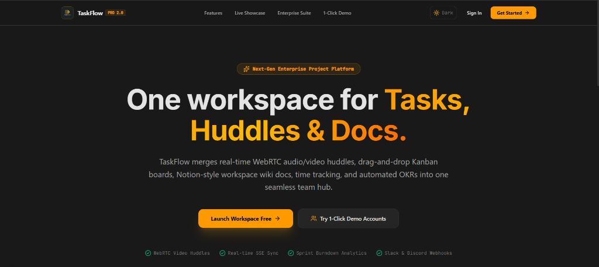

# TaskFlow — Enterprise Project & Collaboration Platform

TaskFlow is a high-velocity, real-time project management and team collaboration suite built on **Next.js 15 App Router**, **WebRTC video/audio streaming**, **Server-Sent Events (SSE)**, and **Prisma ORM**.



---

## 🌟 Key Features & Modules

### 🎙️ 1. WebRTC Team Audio & Video Huddles
- **Live Call Streaming**: Real-time WebRTC video/audio calls with 1-click screen sharing.
- **Privacy First**: Microphone and camera start **OFF by default** upon joining.
- **Solo Host View**: Starts with host card only; teammates appear dynamically when they join.
- **AI Action Notes & Meeting Chat**: Live call chat and 1-click meeting decision to Task conversion.
- **Schedule Future Meetings**: Dedicated sidebar schedule button + Dashboard Upcoming Meetings widget.

### 📊 2. Advanced Analytics & Sprint Burndown
- **Burndown Graphic**: Interactive SVG chart plotting ideal slope vs. actual task effort remaining over a 14-day sprint.
- **Velocity Metrics**: Track tasks closed per week, average lead time (2.4 days), and cycle time (1.1 days).
- **Export CSV Exporter**: 1-click export of workspace analytics telemetry.

### 📝 3. Workspace Docs & Notion-Style Wiki
- **Document Manager Sidebar**: Organized by categories (*Engineering, Specs, Onboarding*).
- **Markdown Editor**: Rich document editor with category tags, `@task` references, and real-time state save.

### ⏱️ 4. Live Time Tracker & Billable Timesheets
- **Live Task Timer**: Digital timer widget on tasks with Start / Pause / Log Entry controls.
- **Timesheet Summary Table**: Tracks task duration, member name, hourly rates, and total billable cost.

### 🔔 5. Slack & Discord Incoming Webhook Integrations
- **Webhook Dispatcher**: Configure Slack and Discord incoming webhook URLs under Workspace Settings.
- **Test Webhook Trigger**: 1-click validation to verify live channel notification dispatch.

### 🎯 6. OKRs & Strategic Goals Tracker
- **Quarterly Objectives**: Strategic company goals with progress bars and Key Result indicators.
- **Custom Target Units**: Track progress per Key Result with target units (`%`, `users`, `ms`).

### 🌐 7. Client Share Links
- **Public Share Portal**: Generate secure read-only guest links (`/share/[token]`) for external clients without account login.
- **Access Controls**: Token copy button and access revocation controls.

### 📥 8. Data Import / Export & Workspace Backup
- **Task Importer**: Bulk import tasks via CSV or JSON arrays into any selected project.
- **1-Click Workspace Backup**: Export full JSON backups containing projects, tasks, comments, and members.

---

## ⚡ Additional Pro Tools

- 🎯 **Focus Mode & Pomodoro Timer**: Distraction-free execution timer with ambient white noise.
- ⚡ **No-Code Automation Rules Engine**: Trigger-action workflow builder (*e.g., when status is Done → auto-assign & send notification*).
- ✨ **AI Standup & Breakdown**: Smart summary generator and automated subtask breakdown.
- 📅 **Gantt Schedule Timeline**: Interactive visual timeline with milestone tracking.
- 🎨 **Visual Whiteboard & Mind Mapper**: Infinite canvas with sticky notes, shapes, connectors, and 1-click "Convert Mind Map to Task".
- 📊 **Team Workload & Capacity Heatmaps**: 7/14 day workload heatmaps, overload alerts, and 1-click task reassignment.

---

## 🛠️ Technology Stack

- **Framework**: Next.js 15 (App Router)
- **UI Engine**: React 18, Tailwind CSS, Lucide Icons, Framer Motion
- **Real-Time Stream**: Server-Sent Events (SSE)
- **Video & Audio**: WebRTC (`getUserMedia`, `getDisplayMedia`)
- **Database & Auth**: SQLite, Prisma ORM, JWT, bcryptjs

---

## 🚀 Getting Started

### 1. Clone the repository
```bash
git clone https://github.com/Megha-r20/TaskFlow.git
cd TaskFlow
```

### 2. Install dependencies
```bash
npm install
```

### 3. Setup Database & Seed Data
```bash
npx prisma db push
npm run seed
```

### 4. Run Development Server
```bash
npm run dev
```

Open [http://localhost:3000](http://localhost:3000) in your browser.

---

## 👥 1-Click Demo Login Accounts

| Role | Email | Password |
| :--- | :--- | :--- |
| **👑 OWNER** | `alex@taskflow.com` | `password123` |
| **🛡️ ADMIN** | `sarah@taskflow.com` | `password123` |
| **👤 MEMBER** | `david@taskflow.com` | `password123` |

---

## 📜 License

Distributed under the MIT License. Built for high-velocity teams.
